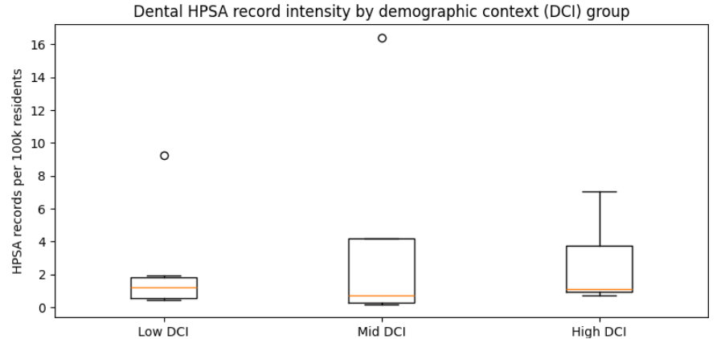
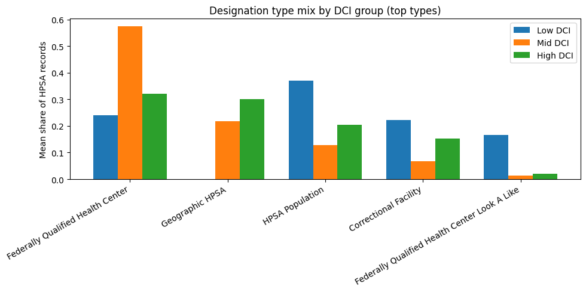

# NJ Dental HPSA Equity: Comparative County Patterns

**Research question:**  
How do Dental HPSA designation patterns differ between counties with high immigrant and minority populations versus predominantly non-immigrant counties in New Jersey?

## Approach
- HRSA Dental HPSA detail records filtered to NJ counties
- County-level ACS proxies (% foreign-born, race/ethnicity shares, limited-English households)
- Counties grouped into Low / Mid / High demographic-context (DCI) terciles
- Comparative analysis of:
  - HPSA record intensity per 100k residents
  - Severity structure (max score, share high-severity)
  - Designation-type mix (geographic vs population vs facility)

## Key Outputs
- `data/processed/nj_county_hpsa_acs_comparative.csv`
- Figures in `figures/`
- Report in `reports/report.md`

## Figures

## Run
1. Put HRSA input file(s) into `data/raw/` (see `data/raw/README.md`)
2. Create env and install deps:
   - `pip install -r environment/requirements.txt`
3. Run notebooks in `notebooks/`
